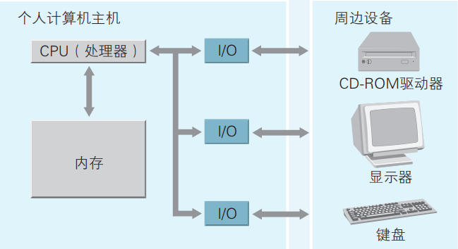
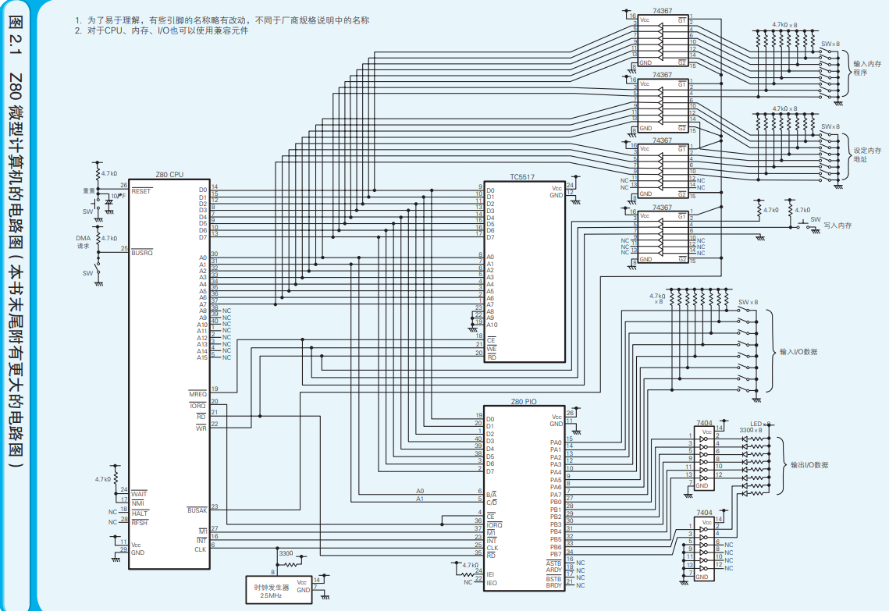
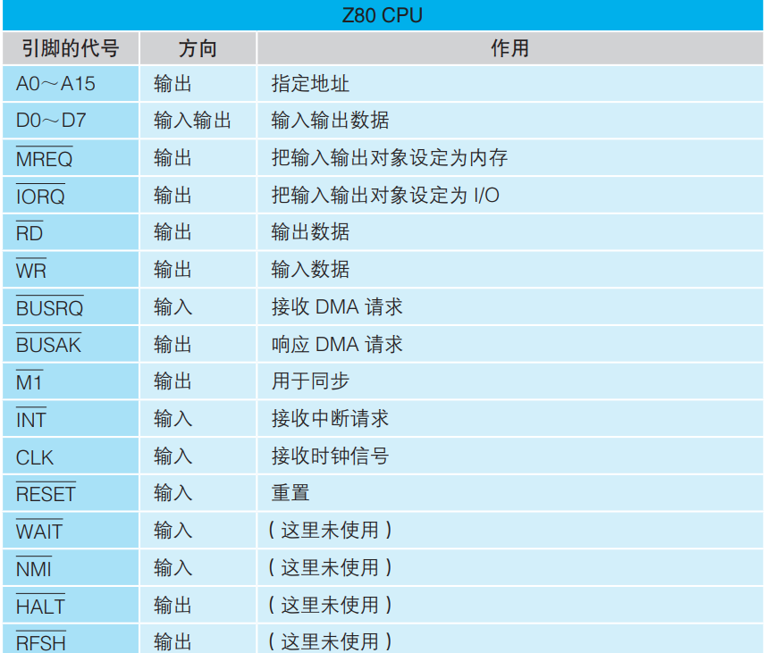
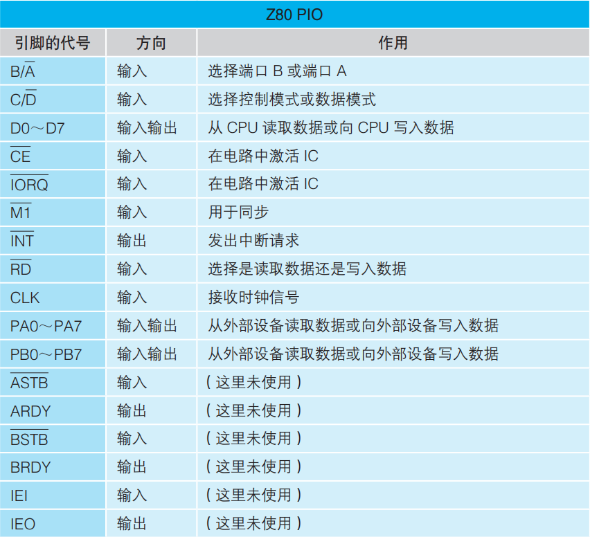
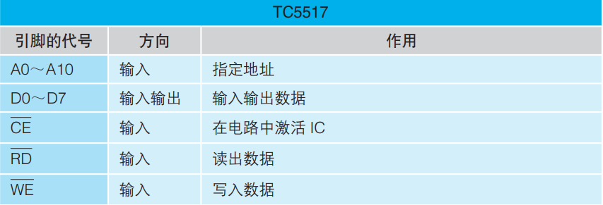

# 计算机三大原则

+ 计算机是执行输入、运算、输出的机器
+ 程序是指令和数据的集合
+ 计算机的处理方式有时候和人们的思维方式不同（计算机是工具使用时难免要违背人们的思维习惯）

**计算机的优化方式总是拟人化的，朝着人类方向发展！！！**

**程序中的数据分为两类：**

+ 作为指令执行对象的输入数据
+ 从指令的执行结果得到的输出数据

编程方法：面向对象编程和面向组件编程。两者进化目标方式一致，都是程序员可以在编程过程中继续沿用人类创造食物的方法。

+ 面向对象：先实现对现实世界的业务建模，之后再把模型搬到程序中。
+ 面向组件：将组件（程序的零件）组装到一起完后程序。

# 计算机组成结构

***计算机内部只要由各种IC元件构成： CPU（central processing unit 中央处理器）、内存、以及I/O。***

+ cpu对应计算机的大脑，负责解释、执行程序的内容，在其内部可对数据执行运算并控制内存和I/O.
+ 内存用于存储指令和数据。
+ I/O负责把键盘、鼠标、显示器等周边设备和主机连接在一起，实现数据的输入与输出。

时钟信号：内含晶振的被称为时钟发生器的元件发出的滴答的电信号，时钟信号可以衡量CPU的运转速度。

***位数（bit数）：CPU上的数据总线的条数，或者CPU内部参与运算的寄存器的容量，都可以作为衡量CPU性能的比特数（位数），eg:32位操作系统、64位操作系统均是指其对应CPU上的数据总线的条数或者参与运算的寄存器的容量。（一比特等于一个二进制位）***

**8bit微型计算机组成结构：**

Z80CPU：8bitCPU

TC5517：存储2K的8bit内存

Z80PIO:(并行输入/输出设备)可以在微型计算机和外部设备之间并行地输入输出8bit的数据。

74367:三态总线缓冲器

7404：六反向器

**芯片IC引脚读取方法：** 缺口朝上，左手边第一个引脚对应1，依次逆时针读取。

> **地址总线：** *指定输入输出数据时的源头或者目的地，CPU上备有“地址总线引脚”，Z80CPU包含地址总线引脚16个，用代号A0~A15表示；可以指定的地址共有65536个，对应65536个数据存储单元（内存存储单元或I/O地址），进行信息的输入输出。*

> **数据总线：** *一旦指定了存储数据的地址，就可以使用数据总线进行数据的输入输出了。Z80CPU的数据总线的引脚为8个，代号D0~D7表示，可一次性输入输出8bit的数据。超过8bit的数据，需要按照8bit分割数据进行传输。*

> **控制总线：** *CPU中用于控制其他IC的功能的总线* eg:MREQ和IORQ 分别对应内存请求和I/O请求，上述连接使用相同的地址总线A0 A1,因此当地址的最后两位处理时（00、01、11、10）无法判断访问的是TC5517中的存储单元，还是Z80PIO中的寄存器，因此需要控制引脚，选中对应的芯片。

**DMA（Direct Memory Access，直接存储器访问）：不经过CPU而直接从外设中读写内存的行为;个人计算机里，硬盘等设备要读写内存使用的就是DMA。使用时，首先BUSRQ（总线请求）的值先在0 1切换，当为0时，CPU从电路中隔离。BUSAK（响应总线请求）引脚变为0，通知外部设备进行读写然后才能进行DMA操作。**

